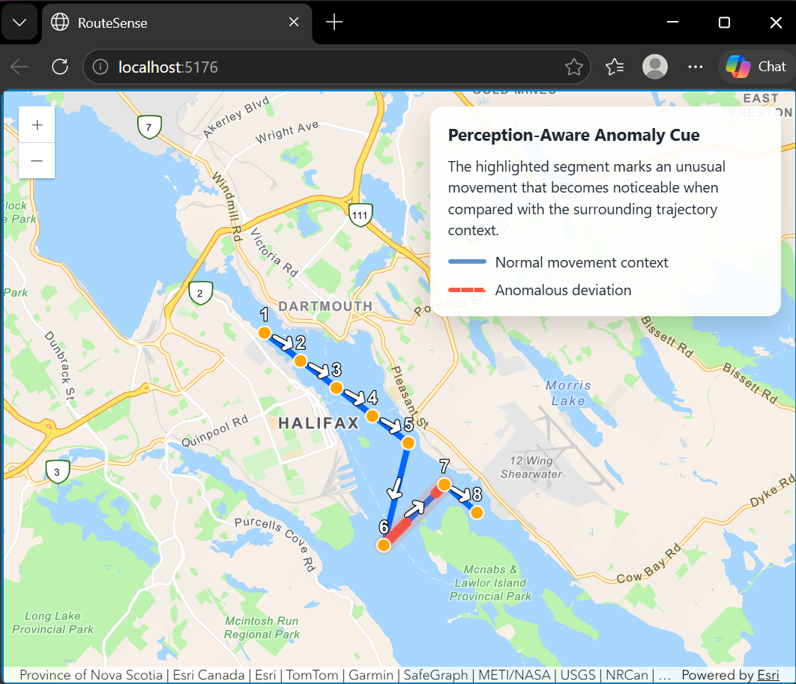
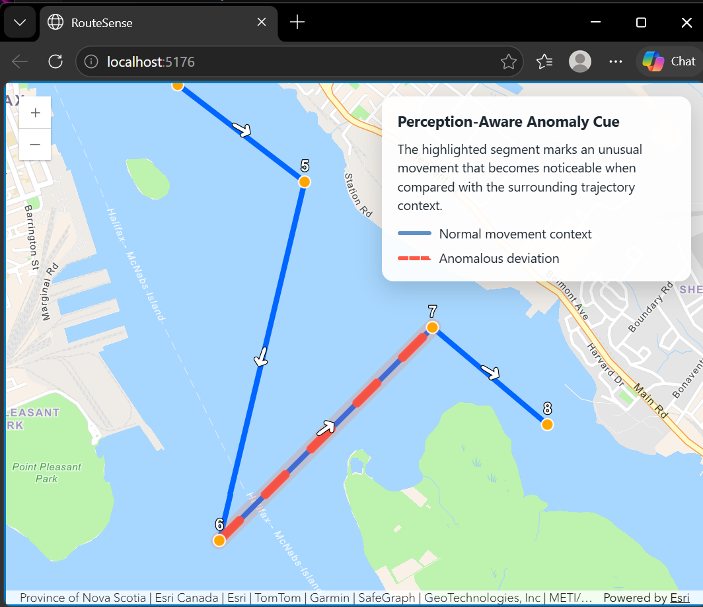
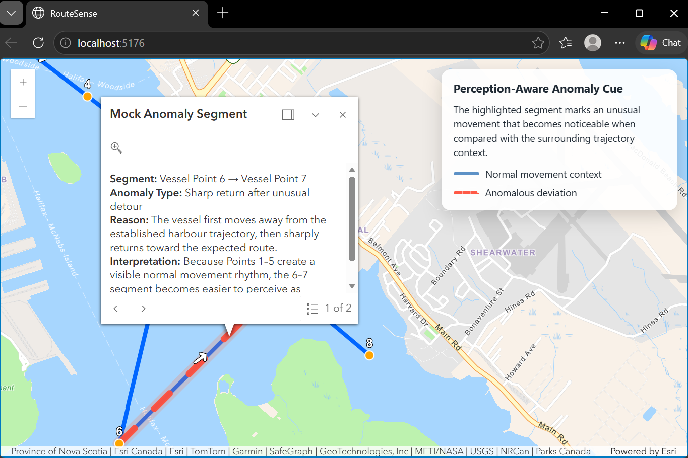

# RouteSense

**RouteSense** is a perception-aware maritime trajectory visualization project built with JavaScript, ArcGIS/web mapping tools, and AIS trajectory data.

## Abstract

RouteSense is a web-based maritime trajectory visualization prototype built with JavaScript and ArcGIS Maps SDK. The project explores how perception-aware interface design can help users interpret unusual movement patterns in vessel trajectory data. The current prototype demonstrates an 8-point Halifax Harbour trajectory, a manually selected anomaly segment, panel-first interaction, computed trajectory evidence, and a comparison between normal movement baseline and anomalous segment behavior. Future phases will introduce threshold-based anomaly detection and evaluate whether perception-aware cues improve users’ ability to identify unusual trajectory segments.

## Project Goal
The goal is to explore how visual interface design can help users interpret vessel movement patterns more clearly, especially when identifying unusual routes, speed changes, sharp turns, or other movement anomalies.

This project connects technical web mapping with research interests in HCI, visual perception, interpretation, and representation. It is being developed as a portfolio project for a thesis-based MSc Computer Science application.

## Core Direction

- JavaScript-based interactive web mapping
- ArcGIS Maps SDK / web GIS visualization
- AIS or maritime trajectory datasets
- Perception-aware visual design
- Human interpretation of movement patterns

## Current Prototype Features

- ArcGIS-based interactive map
- Mock AIS-like vessel trajectory points
- Connected trajectory line showing vessel movement over time
- Highlighted anomalous trajectory segment
- Perception-aware anomaly cue
- Anomaly explanation panel
- Timestamped vessel points and movement context

## Current Status

The prototype currently supports an interactive mock AIS-like trajectory in Halifax Harbour. Users can inspect vessel points, trajectory context, direction arrows, and the manually highlighted anomaly segment through a unified details panel.

The anomaly segment is still manually selected. Automated rule-based anomaly detection has not been added yet.

Rule-based anomaly detection will be developed in a later phase.

## Technology Stack

- JavaScript
- Vite
- ArcGIS Maps SDK for JavaScript
- HTML/CSS

## Current Prototype

The current version includes a basic ArcGIS web map centered on Halifax, Nova Scotia. It plots a few sample vessel-like points near Halifax Harbour and includes simple interactive popups.

This prototype is the first working map foundation for future trajectory visualization features.

The current prototype uses a panel-first interaction model. Instead of relying on floating popups, map elements update a persistent details panel so users can compare vessel points, route context, direction cues, and the highlighted anomaly in one consistent interpretation space.

## Project Progress

| Phase | Focus | Status |
|---|---|---|
| Phase 0 | Project setup, tools, and GitHub repository | Complete |
| Phase 1 | Basic ArcGIS map prototype | Complete |
| Phase 1.5 | Map styling and interface cleanup | Complete |
| Phase 2 | Sample maritime trajectory visualization | Complete |
| Phase 3 | Mock anomaly segment highlight | Complete |
| Phase 3.5 | Expanded trajectory context for anomaly visualization | Complete |
| Phase 4 | Perception-aware anomaly styling and explanation panel | Complete |
| Phase 4.5 | Prototype stabilization and portfolio notes | Complete |
| Phase 5 | Trajectory point interaction and selected-point details panel | Complete |
| Phase 5.5 | Unified interaction panel for trajectory line, anomaly segment, direction arrows, and vessel points | Complete |
| Phase 6 | Rule-Based Anomaly Evidence | Complete |
| Phase 7 | Threshold-Based Anomaly Detection Starter | Complete |

## Phase 0: Project Setup

- Set up VS Code
- Installed Node.js
- Set up Git
- Created GitHub repository
- Defined basic project folder structure
- Wrote initial project statement

## Phase 1: Map Starter

- Created `public/index.html`
- Created `src/style.css`
- Created `src/main.js`
- Added ArcGIS Maps SDK for JavaScript
- Rendered a basic map centered on Halifax
- Added sample vessel points
- Added simple popups for each point
- Committed and pushed the working prototype to GitHub

## Phase 2 Trajectory Starter

The prototype now visualizes the sample vessel points as an ordered trajectory rather than isolated map markers. A blue polyline connects the vessel-like points near Halifax Harbour, while each point includes basic trajectory metadata such as order and timestamp.

To improve visual interpretation, the map also displays numbered point labels and directional arrow cues along the trajectory. These cues help users perceive the movement sequence more quickly without relying only on popups.

Current trajectory features include:

- Three sample vessel-like points near Halifax Harbour
- A connected blue trajectory line
- Route-level metadata, including route name and vessel ID
- Point-level metadata, including order and timestamp
- Numbered labels directly on the map
- Direction arrows showing movement flow from point 1 → 2 → 3
- Popups for both vessel points and the trajectory line

## Phase 3: Mock Anomaly Starter

Phase 3 introduces the first mock anomaly visualization for RouteSense.

In this phase, the project adds anomaly metadata to selected trajectory points and uses that metadata to create a highlighted anomalous segment on the map. The anomaly segment is displayed with a red line so that it visually stands out from the normal blue trajectory line.

This phase also adds an anomaly popup that explains:

- Which segment is being highlighted
- What kind of anomaly is being mocked
- Why the segment is visually emphasized
- How the highlighted segment supports perception-aware visualization testing

Phase 3 keeps the earlier trajectory visualization elements working, including point markers, labels, arrows, timestamps, trajectory lines, and popups.

## Phase 3.5: Expanded Trajectory Context

Phase 3.5 expands the mock AIS-like sample trajectory from a simple 3-point route into an 8-point trajectory near Halifax Harbour.

The goal of this phase is to make the anomaly easier to perceive by giving the viewer more movement context. Points 1–5 establish a mostly consistent movement rhythm, while Points 6–7 form a highlighted anomalous segment. This makes the red anomaly line feel more meaningful because it can now be compared against the normal trajectory pattern.

This phase preserves the existing visualization elements from earlier phases:

- Point markers
- Numeric point labels
- Direction arrows
- Timestamps
- Trajectory line
- Anomaly highlight
- Popups

This update supports the perception-aware goal of RouteSense: anomaly detection is not only about marking unusual data, but also about designing enough visual context for the viewer to interpret why something appears unusual.

## Phase 4: Perception-Aware Anomaly Design

Phase 4 improves the anomaly visualization from a simple red highlighted segment into a more perception-aware design.

Instead of relying only on color, the anomalous segment now uses multiple visual cues:

- A dashed line style to distinguish the unusual movement pattern from the normal trajectory
- A thicker red-orange line to increase visual salience
- A subtle glow behind the segment to improve contrast against the basemap
- A small explanation panel to help users interpret the anomaly in context

The key design idea is that the anomaly is not defined by color alone. It becomes meaningful when compared with the surrounding trajectory context. Points 1–5 establish a normal movement rhythm, while the Point 6 → Point 7 segment becomes easier to perceive as an unusual deviation.

This keeps the prototype simple while connecting the technical implementation to the project’s broader research direction: perception-aware interface design for maritime trajectory visualization.

## Phase 4.5: Prototype Stabilization & Portfolio Notes

Phase 4.5 focuses on stabilizing the prototype before adding new technical features. Instead of expanding the application, this phase improves the project’s readability, documentation, and portfolio presentation.

The codebase was lightly reviewed and annotated with explanatory comments so that the main prototype structure is easier to follow. The comments clarify important sections such as the map setup, mock AIS-like trajectory data, anomaly segment, perception-aware cue, and explanation panel.

The README was also polished to explain the project goal, current prototype features, technology stack, current status, screenshots, and portfolio relevance. This phase makes clear that the current anomaly is still manually selected for visual prototyping, while rule-based anomaly detection will be developed in a later phase.

Prototype screenshots were added to document the current visual state of the application, including the overall map view, anomaly highlight, and explanation panel.

The main purpose of this phase is to make RouteSense easier to understand as a portfolio project. It connects the working prototype to the broader research direction of human-computer interaction, visual perception, interpretation, and maritime trajectory visualization.

## Phase 5: Trajectory Interaction

Phase 5 adds a basic interaction layer for inspecting the mock AIS-like trajectory. Users can click individual vessel points to update the details panel with local timestamp, order, and movement notes. The selected point is visually highlighted, and clicking empty map space clears the selection and restores the default anomaly explanation.

This phase focuses on user inspection and interpretation of the existing trajectory context. It does not add automated anomaly detection yet; the anomaly segment remains manually defined for prototype and visualization purposes.

## Phase 5.5: Unified Interaction Panel

Phase 5.5 refines the interaction design by moving map-element explanations into a single persistent details panel.

Earlier versions used a mix of interaction patterns: vessel points updated the panel, while trajectory lines, anomaly segments, and direction arrows relied on ArcGIS popups. This phase makes the interface more consistent by using the panel as the central interpretation space.

Users can now click different map elements and inspect their meaning in the same panel:

- Vessel points show local timestamp, order, and movement notes
- Anomaly points include an additional warning that they belong to the highlighted anomaly segment
- The trajectory line shows the overall route context
- The anomaly segment explains why the selected deviation is visually meaningful
- Direction arrows explain movement direction between consecutive sampled positions
- Clicking empty map space clears the selection and restores the default explanation

This phase keeps popups disabled for now so that interpretive feedback remains centralized and does not visually compete with the map.

The goal is not to add automated detection yet. Instead, Phase 5.5 strengthens the user inspection workflow before rule-based anomaly logic is introduced.

## Phase 6 — Rule-Based Anomaly Evidence

Phase 6 introduces computed trajectory evidence to support interpretation of the manually selected anomaly segment.

This phase does not claim full automated anomaly detection. Instead, it adds early rule-based evidence that helps explain why the selected segment appears unusual relative to the surrounding movement context.

### Phase 6A — Rule-Based Anomaly Evidence Starter

Phase 6A adds computed trajectory evidence for each consecutive point-to-point segment.

The prototype now computes:

- Segment distance using the Haversine formula
- Time difference between trajectory points
- Estimated segment speed
- Heading direction
- Heading change between consecutive trajectory segments
- Segment-level evidence stored in `segmentEvidence`
- Rule metadata stored in `anomalyRule`

When the manually selected anomaly segment is clicked, the details panel now displays computed evidence such as estimated speed and heading change.

The panel also clearly states that:

- The segment is manually selected
- The current rule status is evidence-only
- Automated anomaly detection has not been added yet

This keeps the prototype academically honest while preparing the system for future threshold-based anomaly detection.

### Phase 6B — Normal vs. Anomaly Evidence Comparison

Phase 6B extends the anomaly evidence panel by comparing the manually selected anomaly segment against a normal movement baseline.

The baseline is calculated from the earlier normal trajectory rhythm across Points 1–5. This allows the anomaly segment to be interpreted relative to prior movement context rather than as an isolated visual highlight.

The panel now shows:

- Average speed for the normal baseline
- Average heading change for the normal baseline
- Estimated speed and heading change for the selected anomaly segment
- Speed deviation from the baseline
- Heading deviation from the baseline

This comparison strengthens the perception-aware design argument because the anomaly becomes meaningful through contrast with surrounding trajectory behavior.

The project still does not perform full automated anomaly detection at this stage. The current goal is to make the evidence visible, interpretable, and grounded in the trajectory context.

## Phase 7: Threshold-Based Anomaly Detection Starter

Phase 7 introduces a simple threshold-based prototype rule for segment-level anomaly evidence.

Until Phase 6, the highlighted anomaly segment was manually selected and explained using computed movement evidence. In Phase 7, the prototype begins to evaluate each trajectory segment using a simple rule based on speed and heading change.

The threshold-based prototype rule flags a segment when either:

- its estimated speed is greater than 1.5× the normal baseline average speed, or
- its heading change is greater than 45 degrees

The primary RouteSense anomaly segment remains Vessel Point 6 → Vessel Point 7. This segment is retained as the main narrative anomaly because it represents the unusual movement pattern designed for the perception-aware prototype.

The threshold rule provides supporting evidence rather than replacing the primary anomaly highlight. For example, another segment may be rule-flagged because of speed, but it does not automatically become the main highlighted anomaly.

This phase keeps the distinction between:

- the primary RouteSense anomaly segment
- rule-flagged segments from the threshold-based prototype rule
- normal baseline movement used for comparison
- computed evidence shown in the interaction panel

The panel-first interaction model remains unchanged. Popups are still disabled, and interpretation continues through the side panel.

This is a simple detection starter. It is not production-ready anomaly detection and has not been trained or validated on real AIS data yet.

## Planned Evaluation

A future evaluation will test whether perception-aware visual cues help users identify unusual trajectory segments more effectively than a baseline design.

Planned task:
Participants will inspect maritime trajectory visualizations and identify the segment that appears unusual.

Planned conditions:
- Baseline condition: anomaly shown using a simple color highlight only
- Perception-aware condition: anomaly shown using multiple cues such as color, line thickness, dashed styling, glow, contextual explanation, and computed evidence in the panel

Planned metrics:
- Time-to-detection
- Accuracy of anomaly identification
- Confidence rating
- Cognitive load, potentially using NASA-TLX

Planned sample:
A small exploratory study with approximately 10 participants.

Status:
This evaluation has not been conducted yet. It is documented as a future research direction for validating the interface design.

## Next Step

The next phase will focus on trajectory interaction. Before implementing rule-based anomaly detection, the prototype will improve how users inspect trajectory points, compare normal and unusual movement segments, and interpret highlighted route behavior through the interface.

Rule-based anomaly logic will be developed after the interaction layer is stable.

## Screenshots

### Overall Map View

### Anomaly Highlight View

### Explanation Panel View

## Portfolio Note

RouteSense is a prototype web mapping application that visualizes maritime vessel trajectories and explores how perception-aware interface design can support anomaly interpretation.

The current prototype uses mock AIS-like trajectory data around Halifax Harbour. It highlights a manually selected unusual movement segment and adds visual cues and an explanation panel to help users interpret why that segment may stand out from the surrounding movement pattern.

This project connects modern JavaScript web mapping with broader research interests in human-computer interaction, visual perception, interpretation, and representation. It is intended as a portfolio project for thesis-based graduate study in computer science.

## Design Decisions
### Visualization Design Framework

This prototype is also informed by established visualization design frameworks. Munzner’s Nested Model provides a way to separate the problem domain, data abstraction, visual encoding, interaction design, and algorithmic choices. This is useful for RouteSense because the project intentionally develops the interface and interpretation layer before adding full automated anomaly detection.

Bertin’s work on graphical perception and visual variables also informs the project’s use of multiple visual cues. Instead of relying only on color, the anomalous segment uses line thickness, dashed styling, contrast, and contextual placement within the surrounding trajectory.

## References
- Munzner, T. (2009). A nested model for visualization design and validation. *IEEE Transactions on Visualization and Computer Graphics*, 15(6), 921–928.
- Bertin, J. (1983). *Semiology of Graphics*. University of Wisconsin Press.